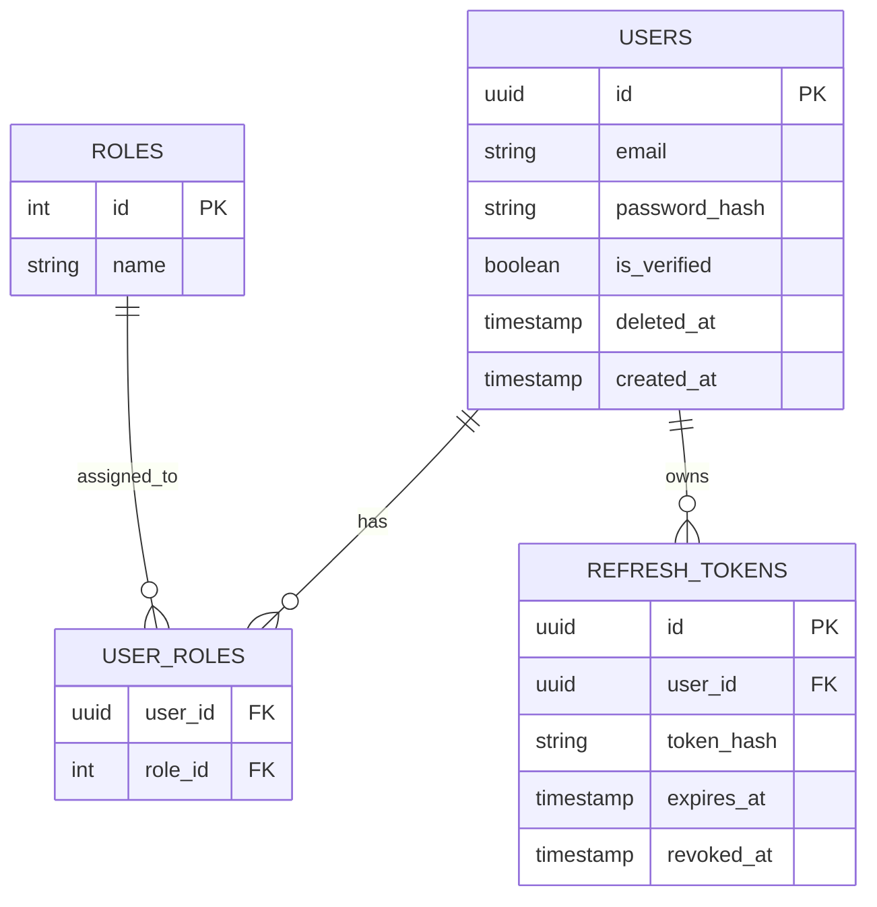

# Aegis IAM: Custom Identity & Access Management

A production-grade, standalone authentication and authorization service built for distributed systems.

## Key Features

- **Authentication System:** Uses JWT with Access Token and Refresh Token for login and session handling.

- **Secure Sessions:** Stores tokens in HTTP-only cookies to improve security and reduce risks like XSS and CSRF attacks.

- **Token Revocation:** Supports logout and token invalidation using Redis for fast performance.

- **Role-Based Access Control (RBAC):** Users can have different roles, and each role can have multiple permissions.

- **User Management:** Uses UUIDs for user IDs and supports soft delete (users are marked as deleted instead of being removed permanently).

- **Password Reset:** Users can reset their password using a secure, time-limited token.

## Architecture Overview

This project follows the **Controller-Service-Repository (CSR) Pattern** to ensure a clean separation of concerns:

- **Controllers:** Handle the "Entry/Exit" (HTTP Request/Response).

- **Services:** The "Brain" (Business logic, JWT signing, password hashing).

- **Repositories:** The "Data Layer" (Strict PostgreSQL interactions and SQL queries).

- **Middleware:** The "Guards" (Authentication verification and RBAC checks).

## Tech Stack

- **Runtime:** Node.js & Express – Selected for high-performance, non-blocking I/O ideal for auth services.

- **Database:** PostgreSQL – Used for its relational integrity and robust support for complex identity schemas.

- **Caching:** Redis – Implemented for sub-millisecond latency during real-time JWT blacklisting checks.

- **Security:** Bcrypt (Adaptive hashing), JSON Web Tokens (Stateless sessions), Helmet (Security headers).

## API Contract

**Authentication (Public)**
| Method | Endpoint | Description |
| ------ | ---------------------------- | ---------------------- |
| POST | /api/v1/auth/register | Register a new user |
| POST | /api/v1/auth/login | Login and get tokens |
| POST | /api/v1/auth/forgot-password | Request password reset |
| POST | /api/v1/auth/reset-password | Reset password |

**Protected Routes**
| Method | Endpoint | Description |
| ------ | -------------------- | ------------------- |
| POST | /api/v1/auth/refresh | Refresh tokens |
| POST | /api/v1/auth/logout | Logout user |
| GET | /api/v1/users/me | Get current user |
| DELETE | /api/v1/users/me | Soft delete account |
| PATCH | /api/v1/admin/roles | Update user roles |

## Database Schema

## Security Highlights

- Token rotation on refresh

- Redis-based JWT blacklist

- Password hashing using Bcrypt

- UUIDs to prevent user enumeration

- Sensitive data is never exposed in responses

## Roadmap

[x] Architecture Design & Schema Planning

[ ] Database Connection & Migration Setup

[ ] Core Authentication (Register/Login Logic)

[ ] Session Management (Refresh/Redis Blacklist)

[ ] RBAC Middleware & Admin Endpoints

[ ] Deployment & Documentation
